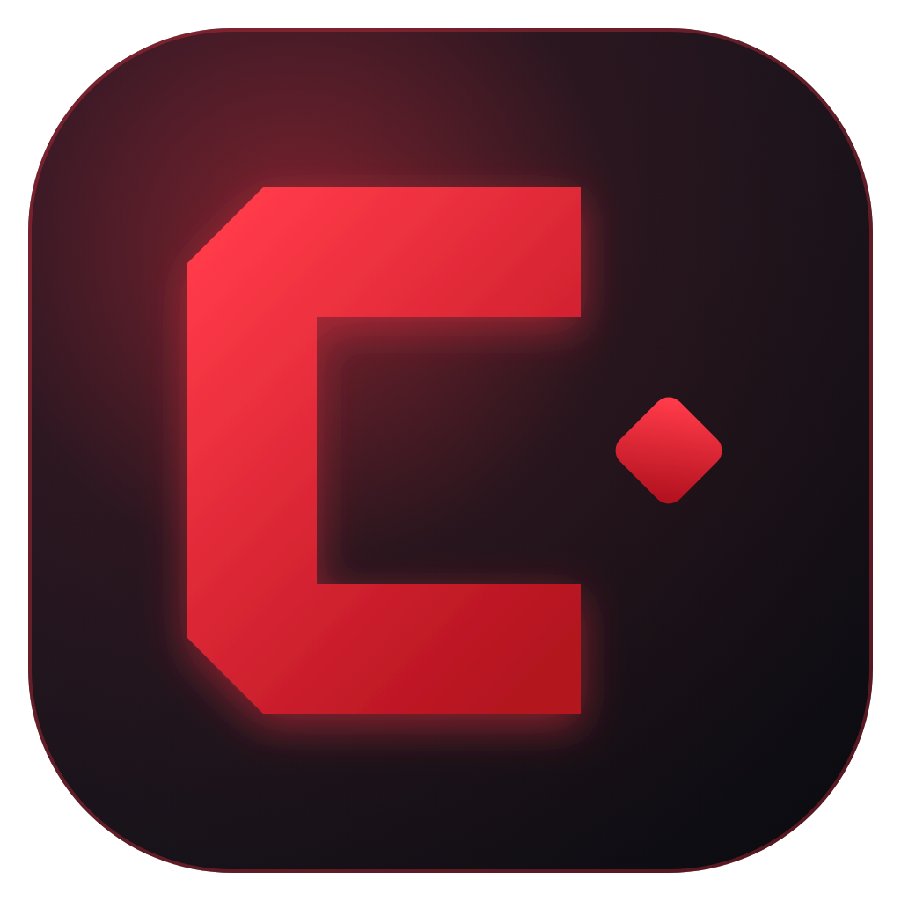

<p align="center">
  
</p>

# CaYaDev Server Manager (MSMS)

> Portable, open-source desktop control panel for Minecraft servers — bilingual (English / Türkçe), built with Electron + React + TypeScript. A **CaYaDev** project.

[](LICENSE)


---

## 🇬🇧 English

**MSMS** is a portable, single-file control panel for running and managing Minecraft servers.
It drops next to your servers, stores all of its data in its own launch folder, and lets you
create, configure, monitor and control servers from a clean graphical interface.

### ✨ Highlights
- **Portable** — the app uses the folder it is launched from as the root. Your servers live in
  sub-folders and all app data is stored in `msms-data/` next to the executable. Move the folder,
  keep everything.
- **Bilingual** — English and Turkish, auto-detected from your system, defaulting to English.
- **Manage existing servers** — point it at a folder and it detects the server type & version.
- **Live console** — real-time log streaming with command input and history.
- **Safe start / stop / restart** — graceful shutdown broadcasts a countdown to players **in the
  panel's language** and saves the world before stopping. No orphaned Java processes on quit.
- **Optimised launch flags** — Aikar's flags presets (incl. large-heap tuning) or fully custom
  JVM arguments, with a live command preview.

### 🧩 Features
| Area | Status |
|------|--------|
| Portable data root, config, single-instance | ✅ |
| EN/TR i18n with auto-detect | ✅ |
| Server discovery / add existing / detect type & version | ✅ |
| Process manager: start / stop / restart / kill, live console | ✅ |
| Graceful shutdown with localized player countdown + kick | ✅ |
| RCON control layer (auto-enable, live TPS, world controls) | ✅ |
| Create-server wizard (Vanilla, Paper, Folia, Purpur, Fabric, Forge, NeoForge, Mohist, Velocity) with live versions + hash-verified downloads | ✅ |
| Optimised launch flags (Aikar presets + custom) with live preview | ✅ |
| `server.properties` GUI editor (typed) + raw + file explorer/editor | ✅ |
| Player management (OP, whitelist, ban, kick, gamemode, playtime, position, health, IP…) | ✅ |
| Live stats: CPU, RAM, TPS, players, uptime | ✅ |
| Plugin / mod manager (local + Modrinth search & install) | ✅ |
| Backup system (world/full, any drive) + restore + retention | ✅ |
| Cron scheduler (restart / backup / command / broadcast) | ✅ |
| Crash analyzer (known-pattern detection with fixes) | ✅ |
| CI + automated portable-exe releases + in-app update check | ✅ |

> Notes: Forge/NeoForge run their official installer (`--installServer`) on create.
> Spigot is intentionally not one-click (it requires BuildTools compilation).

### 🚀 Getting started (development)
```bash
npm install
npm run dev          # launch in development
npm run build        # type-check + bundle
npm run dist:portable # build a portable Windows .exe
```
Requires **Node.js 20+** and a **JDK** (Java 17+ for modern Minecraft) on your machine.

---

## 🇹🇷 Türkçe

**MSMS**, Minecraft sunucularını çalıştırmak ve yönetmek için taşınabilir, tek dosyalık bir
kontrol panelidir. Sunucularınızın yanına bırakılır, tüm verilerini kendi çalışma klasöründe
saklar; sunucuları temiz bir grafik arayüzden oluşturur, yapılandırır, izler ve kontrol edersiniz.

### ✨ Öne çıkanlar
- **Taşınabilir** — uygulama, açıldığı klasörü kök dizin olarak kullanır. Sunucularınız alt
  klasörlerde, tüm uygulama verisi ise çalıştırılabilir dosyanın yanındaki `msms-data/` klasöründe
  saklanır. Klasörü taşıyın, her şey sizinle gelsin.
- **Çift dilli** — İngilizce ve Türkçe; sistemden otomatik algılanır, desteklenmeyen dilde
  varsayılan İngilizcedir.
- **Var olan sunucuları yönetin** — bir klasör seçin, uygulama sunucu türünü ve sürümünü algılasın.
- **Canlı konsol** — gerçek zamanlı günlük akışı, komut girişi ve komut geçmişi.
- **Güvenli başlatma / durdurma / yeniden başlatma** — nazik kapatma, oyunculara **panel dilinde**
  geri sayım anonsu yapar ve durdurmadan önce dünyayı kaydeder. Çıkışta artık işlem bırakmaz.
- **Optimize başlatma argümanları** — Aikar bayrakları ön ayarları (büyük heap ayarı dahil) veya
  tamamen özel JVM argümanları; canlı komut önizlemesiyle.

### 📜 Lisans
MIT — bkz. [LICENSE](LICENSE).

> Bu proje Mojang Studios veya Microsoft ile bağlantılı değildir. "Minecraft" Mojang Studios'un
> ticari markasıdır.
