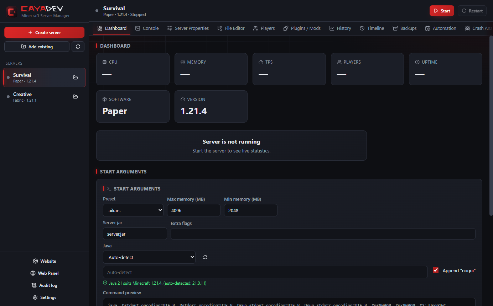
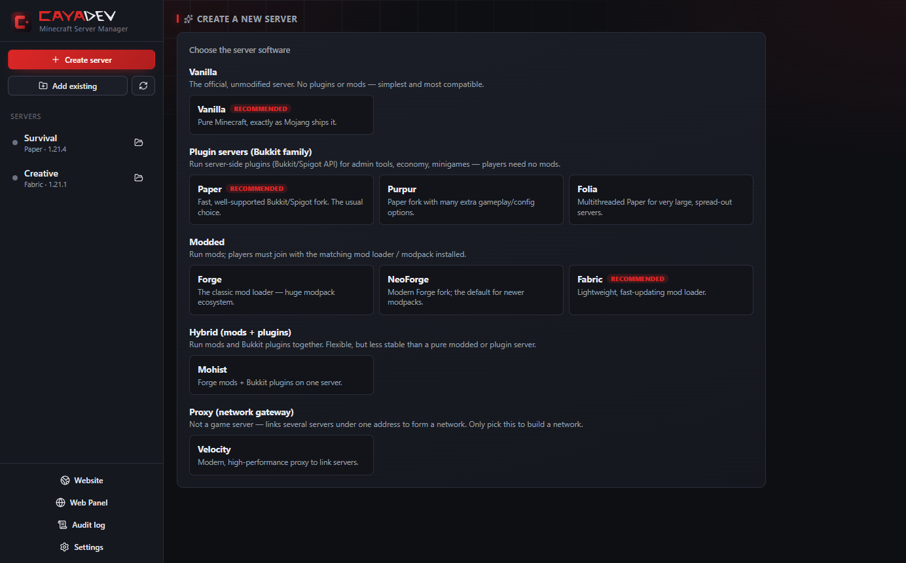
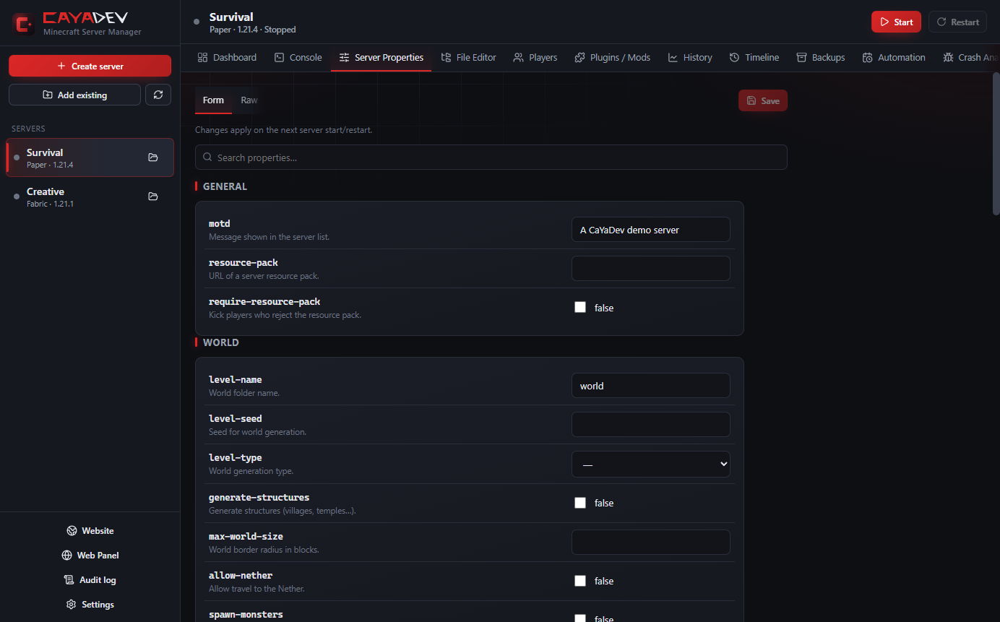
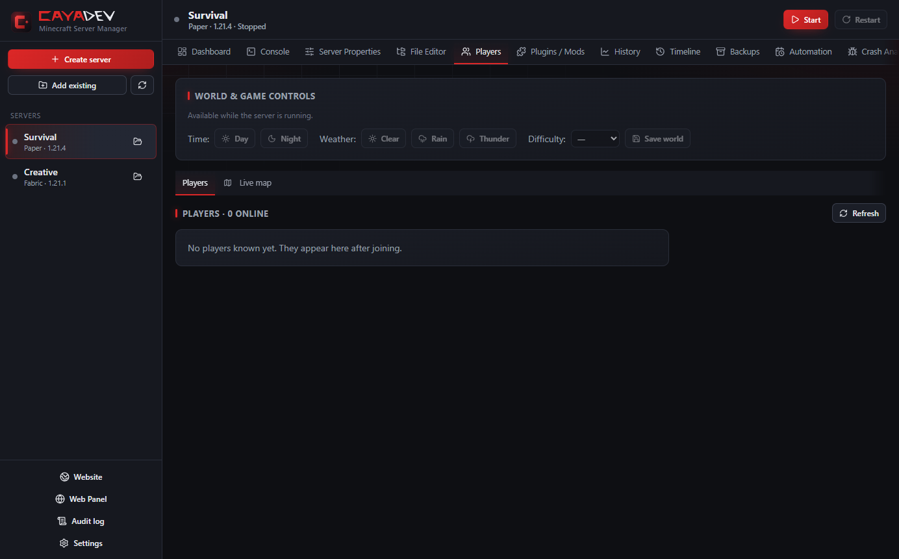
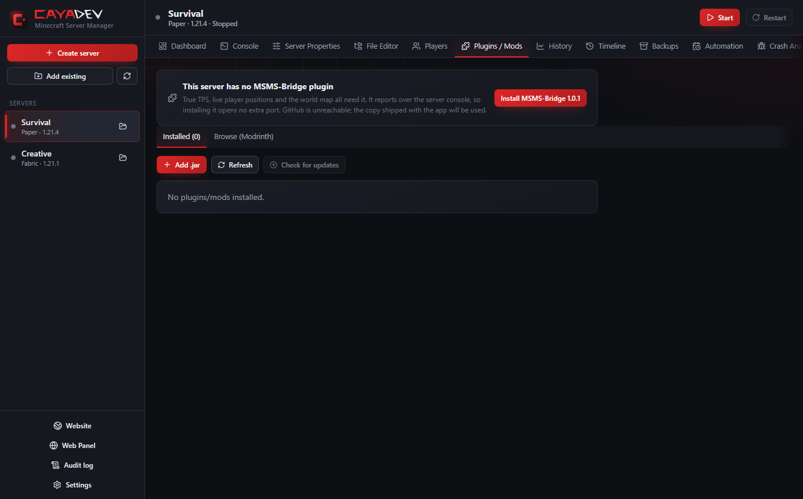
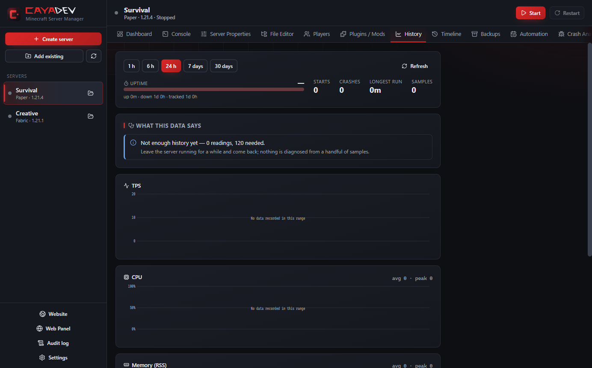
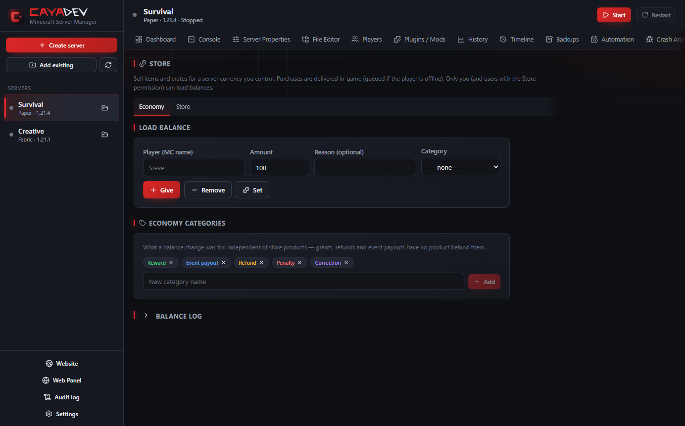
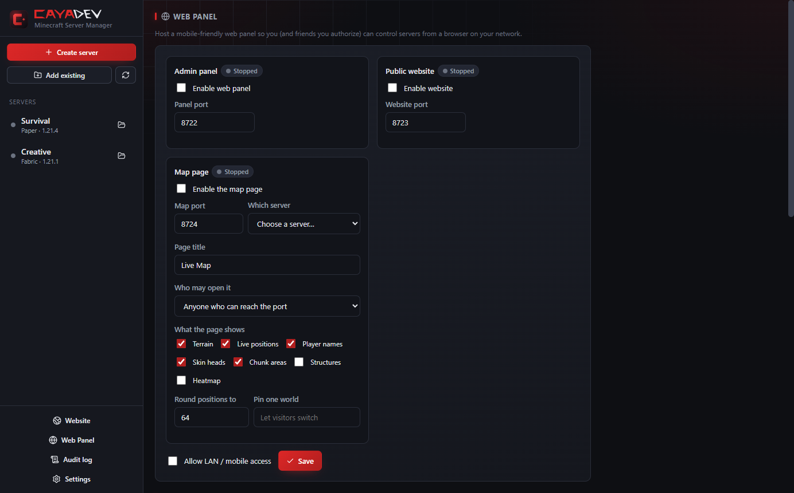
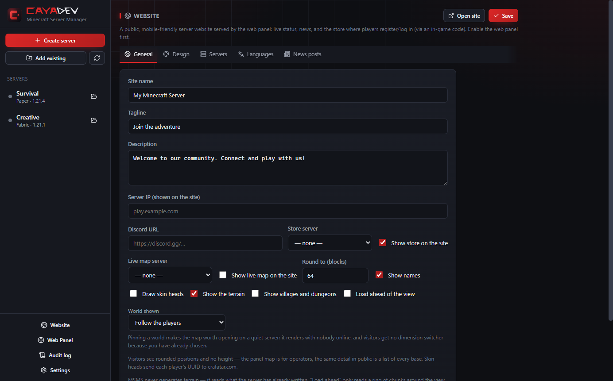

<p align="center">
  
</p>

<p align="center">
  <strong>CaYaDev Server Manager (MSMS)</strong> 

<p align="center">
  Portable, open-source desktop control panel for Minecraft servers — bilingual (English / Türkçe), built with Electron + React + TypeScript. A <strong>CaYaDev</strong> project.
</p>

<p align="center">
  <a href="LICENSE"></a>
  
  
</p>

<p align="center">
  <a href="#-overview">Overview</a> •
  <a href="#-features">Features</a> •
  <a href="#-supported-server-software">Server Software</a> •
  <a href="#-getting-started">Getting Started</a> •
  <a href="#-screenshots">Screenshots</a> •
  <a href="#-web-panel">Web Panel</a> •
  <a href="#-the-map-page">Map Page</a> •
  <a href="#-development">Development</a> •
  <a href="#-roadmap">Roadmap</a>
</p>

---

## 🌍 Language

This README is written primarily in English so the project is accessible to the wider Minecraft and open-source community.

The application itself supports:

- **English**
- **Türkçe**
- Automatic system-language detection
- English fallback when the operating-system language is unsupported

A Turkish project summary is available near the end of this README: [Türkçe Özet](#-türkçe-özet).

---

## 📌 Project Status

MSMS is under active development, and the whole of it now runs: the desktop
manager, the **admin web panel**, the **public website with its store and
economy**, and a **third page that is nothing but a fullscreen live map**. The
web layer and the store are no longer beta — they are covered by the same
automated gates as the rest of the app.

What is still young rather than unfinished:

- **MSMS Bridge** — the plugin builds and self-tests, and the app reads it, but
  it has had far less time in live servers than the desktop core.
- **Modded worlds** — block colours and item icons come from the vanilla client
  jar, so a heavily modded world renders its vanilla blocks correctly and falls
  back to a generated colour for the rest.

Before using MSMS for an important public server, test the workflows you plan to
rely on and keep independent backups of your server data.

---

## 🚀 Overview

**CaYaDev Server Manager**, also referred to as **MSMS (Minecraft Server Management System)**, is a Windows-first desktop application for managing Minecraft servers without requiring a separate web stack, database server or traditional control-panel installation.

It is designed around a portable workflow:

1. Place the application in the directory you want to use as your MSMS root.
2. Add an existing Minecraft server or create a new one.
3. Manage the server from a graphical interface.
4. Keep application data in `msms-data/` beside the executable.
5. Move or back up the complete root folder when needed.

MSMS aims to cover both everyday administration and more advanced server-management tasks from a single application:

- server creation and discovery
- process control
- live console and RCON
- JVM configuration
- player moderation
- worlds
- plugins and mods
- file management
- backups
- scheduled automation
- performance monitoring
- crash analysis
- alerts
- audit/history views
- remote web-panel access
- experimental store/economy tooling

---

## 📸 Screenshots

Every picture below is taken by the app of itself against throwaway demo
servers — `MSMS_SHOTS=<dir>` renders each view offscreen and writes a PNG, so
they can be retaken after a redesign instead of quietly going stale.

### Dashboard

Live CPU, memory, TPS, players and uptime, with the launch arguments and the
exact command MSMS will run underneath them.



### Creating a server

Server software grouped by what it is *for* — vanilla, plugin servers, modded,
hybrid, proxy — rather than an alphabetical list of names a newcomer cannot rank.



### `server.properties`

Every setting with an explanation, grouped and searchable, plus raw editing for
anything MSMS does not know about.



### Players and the live map

Moderation, world controls, the NBT inventory viewer, and a live map rendered
from the server's own region files.



### Plugins and mods

Installed jars with enable/disable, plus Modrinth search and one-click install.



### History

CPU, memory, TPS and player count over time, with an analysis pass that says
what the data means rather than leaving you to read four charts.



### Store and economy

A server currency, balances, products, crates with published odds, and in-game
delivery that queues while a player is offline.



### Web panel and public website

Two more surfaces, each with its own listener, port and access rules.





---

## ✨ Why MSMS?

### Portable by design

MSMS uses its launch directory as its working root instead of hiding the project state across unrelated operating-system directories.

That makes it easier to:

- keep the panel beside your Minecraft servers
- move the complete setup to another drive
- back up panel data and server folders together
- maintain multiple isolated MSMS environments
- use removable or secondary storage when appropriate

### Desktop-first administration

MSMS is not built around the assumption that every user wants to deploy a Linux web panel, reverse proxy, SQL database and separate daemon.

For a local machine, Windows server, home lab or development environment, the desktop application can manage the server directly.

### Existing servers are welcome

You do not have to recreate a working server just to start using MSMS.

Existing server directories can be registered and inspected, with server type/version detection used to reduce manual configuration.

### Beginner-friendly without hiding advanced controls

A server can be started and stopped with the GUI, while advanced users can still work with:

- custom JVM arguments
- Aikar-style launch presets
- RCON
- raw configuration files
- scheduled commands
- server files
- backups
- Java runtime selection
- audit/history information

---

## 🧩 Features

### 🖥️ Server Management

MSMS provides a central interface for registered Minecraft servers.

Core process-management capabilities include:

- start
- stop
- restart
- force kill when necessary
- live process state
- uptime tracking
- server registration
- server discovery
- server type/version detection
- management of multiple registered servers
- protection against leaving unmanaged Java processes behind when the application exits

Graceful shutdown workflows can:

- notify connected players
- perform a countdown
- save the world
- disconnect players cleanly
- stop the server after the shutdown sequence

---

### 🖥️ Live Console & RCON

The console is intended to replace the need to constantly switch to a raw terminal window.

Features include:

- real-time log output
- command input
- command history
- server command execution
- RCON-backed management features
- live server information where available
- world/server control operations through the management layer

RCON can be used by MSMS for features that require structured command access.

> RCON credentials should always be treated as sensitive information. Do not expose an RCON port directly to untrusted networks.

---

### 🏗️ Server Creation Wizard

MSMS includes a server-creation workflow that can retrieve available versions and prepare supported server software.

Currently represented in the project:

| Server software | Workflow | Notes |
|---|---|---|
| **Vanilla** | ✅ One-click capable | Official server |
| **Paper** | ✅ One-click capable | Performance-oriented Bukkit-compatible server |
| **Folia** | ✅ One-click capable | Regionized multithreading architecture |
| **Purpur** | ✅ One-click capable | Paper-derived server |
| **Fabric** | ✅ Supported | Modded server platform |
| **Forge** | ✅ Supported | Uses the official installer workflow |
| **NeoForge** | ✅ Supported | Uses the official installer workflow |
| **Mohist** | ✅ Supported | Hybrid/modded workflow |
| **Velocity** | ✅ Supported | Proxy software |
| **Spigot** | ⚠️ Not one-click | BuildTools compilation is intentionally required |

The creation pipeline is designed to support:

- live version retrieval
- server software selection
- downloadable server artifacts
- hash/checksum verification where supported
- official installer execution for Forge/NeoForge
- creation progress reporting
- Java/runtime checks

> Availability can depend on the upstream project, its API and its version metadata.

---

### ☕ Java Runtime Management

Minecraft server versions do not all use the same Java version, so MSMS includes Java-related management rather than assuming one hard-coded runtime.

The project includes modules for:

- Java discovery
- Java scanning
- runtime validation
- Java executable selection
- JVM argument handling
- optional Java provisioning
- portable runtime storage

When provisioning is used, MSMS can prepare an Eclipse Temurin runtime and validate the downloaded/runtime files before use.

Java requirements ultimately depend on the Minecraft version and server software you choose.

---

### ⚙️ JVM Arguments & Launch Profiles

MSMS supports both easy presets and manual control.

Available concepts include:

- configurable minimum heap
- configurable maximum heap
- optimized JVM presets
- Aikar-style flag presets
- large-heap tuning
- fully custom JVM arguments
- launch command preview
- per-server configuration

This lets users start with a recommended profile and later tune the command manually.

Example concept:

```text
java [JVM options] -jar server.jar nogui
```

MSMS generates/manages the final command based on the selected server configuration.

---

### 📝 `server.properties` Management

The application includes a dedicated properties editor for common Minecraft server settings.

The project supports both:

- structured/typed GUI editing
- raw file editing

This allows common options to be changed without manually searching through the complete properties file, while still preserving access to the underlying configuration.

---

### 📁 File Manager & Code Editor

MSMS contains a built-in server file browser/editor.

The editor stack includes CodeMirror language support for:

- JSON
- YAML
- XML
- HTML
- CSS
- JavaScript

The interface is designed around features such as:

- file navigation
- text editing
- syntax highlighting
- multiple editor tabs
- split-view editing
- configuration-file workflows

This is useful for server configuration files, plugin/mod configuration and other text-based server resources.

> Always keep backups before manually editing important configuration or world-related files.

---

### 👥 Player Management

Player administration is available from a dedicated management view.

Supported management concepts include:

- online-player visibility
- OP / de-OP
- whitelist management
- ban / unban
- kick
- gamemode changes
- player-related command execution
- playtime information
- position information
- health information
- IP information where available
- UUID/player identity information

Some information depends on server state, available files, RCON access or Minecraft data formats.

---

### 🎒 Player Inventory Viewer

MSMS includes player-data/NBT functionality for inspecting player inventory information.

The inventory tooling can work with:

- Minecraft NBT player data
- inventory slots
- item identifiers
- item presentation/icons where available

This is intended as an administration/inspection feature rather than a replacement for normal in-game inventory mechanics.

---

### 🌍 World Management

World management has its own core module and UI.

The project is structured to provide centralized access to world-related operations rather than requiring users to manually browse every server directory.

World-management functionality is integrated with other systems such as:

- RCON
- backups
- server files
- server lifecycle operations

Because world data is critical, create a verified backup before destructive or experimental world operations.

---

### 🧱 Plugins & Mods

MSMS includes a dedicated plugins/mods module.

Implemented project capabilities include:

- local plugin/mod management
- Modrinth search
- Modrinth-based discovery
- installation workflows
- server-aware mod/plugin administration

Compatibility remains dependent on:

- Minecraft version
- server software
- mod loader
- plugin API
- the project being installed

Always verify that a plugin/mod is compatible with your exact server version before launching a production server.

---

### 💾 Backups & Restore

Backup management is integrated directly into the application.

The backup system is designed for:

- world backups
- full-server backups
- custom backup locations
- backups to another drive
- restore workflows
- retention handling
- scheduled backup integration

A practical setup is to keep at least one backup outside the active server directory so a disk/folder-level failure does not destroy both the server and every backup at once.

---

### ⏰ Scheduler & Automation

MSMS has a cron-based scheduler for recurring server administration.

Automation types represented by the project include:

- restart
- backup
- command
- broadcast

Example schedule:

```text
03:00       -> Create a backup
04:00       -> Restart the server
Every 30m   -> Broadcast an informational message
Sunday      -> Run a larger maintenance backup
```

The scheduler is intended to reduce repetitive administration work and help standardize maintenance routines.

---

### 📊 Monitoring & Metrics

MSMS includes a metrics layer and dedicated dashboard/history interfaces.

The application can expose server/process information such as:

- CPU usage
- memory/RAM usage
- TPS where available
- online players
- uptime

Dedicated views in the UI include:

- Dashboard
- History
- Timeline

These allow current server state and historical activity to be presented separately instead of reducing monitoring to a single live number.

---

### 🌉 MSMS Bridge

TPS read over RCON is an approximation, and the console can never report MSPT or player positions at all. The **MSMS Bridge** closes that gap with an in-server plugin that prints marked telemetry lines to the server's **standard output** — a stream MSMS already reads.

That transport choice is the point: no extra port, no socket, no firewall rule, no credentials. It works the same for a LAN server, a remote box behind NAT, and a server with every port closed.

The app side is implemented: protocol v1 parsing, and a freshness rule that falls back to RCON the moment the bridge goes quiet — so a crashed plugin cannot leave a frozen TPS on screen.

The plugin itself lives in [`bridge/`](bridge/README.md) and builds with a JDK and Node alone — `node bridge/build.mjs` — no Maven or Gradle. Its output is verified against the app's own parser without needing a Minecraft server.

The app installs it for you from the Players → Live map tab when a server has no
bridge, and it reports through the plugin logger rather than `System.out` so a
Paper server does not nag about it. It has had far less time in live servers
than the desktop core, so treat it as the youngest part of MSMS.

📖 **[Protocol documentation → `docs/bridge-protocol.md`](docs/bridge-protocol.md)** · **[Plugin README → `bridge/README.md`](bridge/README.md)**

---

### 🚨 Alert Rules

The project includes a dedicated alert engine and Alert Rules interface.

This provides a foundation for defining conditions that should be surfaced to the administrator instead of requiring constant manual monitoring.

Alert functionality is useful for workflows involving:

- unusual server state
- resource conditions
- operational events
- administration attention

Exact available rule types may evolve as the project develops.

---

### 📜 Audit, History & Timeline

MSMS keeps three separate histories, on purpose:

| | Records | Scope |
|---|---|---|
| **Audit trail** | who did what, from where, and whether it worked | **global** — survives server deletion |
| **Event log** | typed game and lifecycle facts | per-server |
| **Metrics / History** | CPU, RAM, TPS and player samples over time | per-server |

The audit trail attributes every administrative and security action to an actor — a web username, a player name, or the local operator — and records **failures as well as successes**, so denied logins are visible rather than silently dropped. It is pruned by age and volume only (180 days / 20 000 entries) and is never cleared by deleting a server.

Reading it is a privilege of its own: the web endpoint is gated on owner or an account-level `canAudit` flag, because the log is global and contains IP addresses.

📖 **[Full documentation → `docs/audit-trail.md`](docs/audit-trail.md)**

This becomes increasingly important when a server has multiple administrative actions, scheduled jobs and repeated maintenance events.

---

### 💥 Crash Analyzer

A dedicated crash-analysis module is included.

The crash analyzer is designed to:

- inspect server failure information
- identify known patterns
- surface likely causes
- suggest relevant corrective actions when a recognized pattern exists

Crash analysis should be treated as diagnostic assistance rather than a guarantee that every server failure can be automatically identified.

---

### 🔄 Update Support

The project includes:

- an update-checking module
- CI workflows
- packaging scripts
- Windows portable build support

The application can be packaged as a portable Windows executable with:

```bash
npm run dist:portable
```

---

## 🌐 Web Panel

An admin panel in the browser, on its own listener and port. Everything the
desktop app can do to a server, it can do — console, power, players, files,
backups, settings, the store, worlds and the live map — subject to the same
per-server permissions.

- **Users, roles and per-server scopes.** Nine scopes (`view`, `console`,
  `power`, `players`, `files`, `backups`, `settings`, `store`, `worlds`) granted
  per server, either directly or through a named role.
- **API keys** for integrations, scoped the same way, with ready-to-paste curl,
  JavaScript and Python samples built against your own install's address. A key
  can be **disabled** — reversibly, unlike revoking — or deleted from the list.
- **A documented REST surface** at `/api/v1`, with an OpenAPI document and a
  human-readable reference **the app serves itself**, so it always matches the
  version you are running rather than whatever the docs said last release. Both
  the desktop app and the panel link to it from the key list, next to the code
  samples.
- **Audit log** of every action, with the actor, the source and the IP.

### Secure defaults

- **Disabled by default**, and bound to `127.0.0.1` unless LAN access is
  explicitly switched on.
- Cross-origin requests are **denied by default**; browser origins are an
  allowlist you fill in.
- Keys are stored as salted SHA-256 and shown exactly once, at creation.

### Important security warning

The built-in panel does **not** provide HTTPS by itself. Do not expose it
directly to the public Internet. For remote administration, put it behind a
reverse proxy that terminates TLS, or reach it over a VPN.

Treat panel tokens and API keys as secrets.

---

### Closing MSMS with a server running

It refuses, and says which servers are up. Confirm and it stops them the way you
would — the configured countdown is broadcast to players, the world is saved,
and anything still up after 45 seconds is killed rather than left orphaned
holding the world files.

---

## 🛒 Store & Economy

A server currency and shop that players use from the public website.

- **Balances and a ledger** — every change recorded with who made it, why, and
  the balance it produced.
- **Products and crates**, with crate odds published to buyers before they buy
  and the commands behind a reward never sent to a browser.
- **Stock and per-player limits**, enforced atomically with the balance so a
  product cannot oversell.
- **In-game delivery**, queued while a player is offline and released when they
  return — a purchase is never silently lost because the server was down.
- **Purchases are audited** like everything else.

---

## 🌍 Public Website

A player-facing site on its own listener: news, a storefront, player accounts
linked to Minecraft names, profiles, and a live map.

- **Player accounts** verified in game, which works on an offline-mode server
  too — a code whispered to the player proves they own the name.
- **Profiles** with per-field publishing controls, so an operator decides what a
  visitor may see.
- **Bilingual**, with the site's own language list and default.
- **Mobile-friendly.**

---

## 🗺️ The Map Page

A third listener whose entire design is one fullscreen map.

A separate port rather than a path on the website, and that is the point: it
lets you hand the map to people who must not reach the shop or the panel, with
a firewall rule rather than with trust.

- **Access:** open, a shared passphrase, or signed-in players only. The gate
  refuses the *data*, not just the page.
- **Eleven settings** for what it may show — terrain, live positions, names,
  skin heads, chunk areas, structures, heatmap, coordinate rounding, and
  optionally one pinned world — every one enforced server-side.
- **Named chunk areas.** Mark a region by chunk, give it a colour, a name and a
  note; hovering or clicking it shows them. Created by selecting chunks on the
  map, by typing coordinates, or over the API.
- **The same map engine** as the panel and the website, so all four surfaces
  draw the same world — and **your website's colours**, so it looks like part of
  the same server rather than a different product.
- **Touch:** one finger pans, two pinch, and a tap opens an area's note.

Terrain is read from the server's own region files. MSMS never *generates*
world — a map that could grow a world by being panned would be a map that can
fill a disk.

---

## ✅ Feature Matrix

| Area | Status |
|---|:---:|
| Portable application data root | ✅ |
| Single-instance desktop behavior | ✅ |
| English / Turkish localization | ✅ |
| Automatic language detection | ✅ |
| Existing-server registration | ✅ |
| Server type/version detection | ✅ |
| Multi-server management | ✅ |
| Start / stop / restart / kill | ✅ |
| Live console | ✅ |
| Command history | ✅ |
| Graceful shutdown sequence | ✅ |
| RCON management layer | ✅ |
| Server creation wizard | ✅ |
| Vanilla / Paper / Folia / Purpur | ✅ |
| Fabric / Forge / NeoForge / Mohist | ✅ |
| Velocity | ✅ |
| Spigot one-click binary download | ❌ BuildTools required |
| Java discovery/scanning | ✅ |
| Optional Java provisioning | ✅ |
| Custom JVM arguments | ✅ |
| Optimized/Aikar-style presets | ✅ |
| `server.properties` GUI | ✅ |
| Raw properties editing | ✅ |
| File manager | ✅ |
| Syntax-highlighted editor | ✅ |
| Player moderation | ✅ |
| Player information | ✅ |
| NBT inventory viewer | ✅ |
| World management | ✅ |
| Plugin/mod management | ✅ |
| Modrinth search/install | ✅ |
| Backups / restore | ✅ |
| Retention support | ✅ |
| Cron scheduler | ✅ |
| CPU/RAM/TPS/player monitoring | ✅ |
| History / timeline UI | ✅ |
| Alert rules | ✅ |
| Audit system | ✅ |
| Crash analyzer | ✅ |
| Update checking | ✅ |
| Portable Windows packaging | ✅ |
| Web panel (users, roles, scopes) | ✅ |
| REST API + OpenAPI + API keys | ✅ |
| Public website (news, accounts, profiles) | ✅ |
| Store / economy / crates / delivery | ✅ |
| Live map on all surfaces | ✅ |
| Fullscreen map page (own listener) | ✅ |
| Named chunk areas | ✅ |
| Item icons + block colours from the client jar | ✅ |
| Named roles, assigned per server | ✅ |
| Touch / mobile map (pan, pinch, tap) | ✅ |
| Guarded shutdown while a server runs | ✅ |
| MSMS Bridge plugin | ✅ builds, lightly field-tested |
| Full visual website/CMS builder | 🗺️ Planned / evolving |

---

## 🧱 Supported Server Software

MSMS is designed to support several common Minecraft server ecosystems from one interface.

### Vanilla

Official Minecraft Java Edition server workflow.

### Paper

A widely used high-performance server platform compatible with the Bukkit/Spigot plugin ecosystem.

### Folia

A Paper-derived architecture using regionized multithreading.

### Purpur

A Paper-derived server platform with additional configuration and gameplay customization.

### Fabric

A lightweight mod-loader ecosystem.

### Forge

A long-established modded Minecraft ecosystem.

MSMS uses the Forge installer workflow rather than pretending the installed server can always be represented by one standalone JAR.

### NeoForge

A modern Forge-derived modding ecosystem.

MSMS runs the appropriate installer workflow during server creation.

### Mohist

Hybrid server software aimed at combining modded and plugin-style server use cases.

### Velocity

Proxy software for Minecraft network architectures.

### Spigot

Spigot is intentionally different from simple direct-download server types.

The official/legal distribution workflow involves **BuildTools**, so MSMS does not present Spigot as a normal one-click prebuilt binary download.

---

## 🚦 Getting Started

### Option A — Add an existing server

1. Start MSMS.
2. Choose the option to add/register an existing server.
3. Select the Minecraft server directory.
4. Allow MSMS to inspect the folder.
5. Review the detected server type/version.
6. Configure Java/JVM settings if needed.
7. Start the server from the management interface.
8. Open the console/dashboard to verify normal operation.

Before first use, make an independent backup of an important existing server.

---

### Option B — Create a new server

1. Open the server creation view.
2. Select the desired server software.
3. Select an available Minecraft/server version.
4. Choose the destination directory.
5. Review Java requirements.
6. Start the creation/download process.
7. Complete EULA/configuration requirements.
8. Configure memory/JVM settings.
9. Start the newly created server.

Forge and NeoForge may require installer execution as part of the creation process.

---

## 📦 Portable Data Model

A typical MSMS installation is conceptually organized like this:

```text
MSMS/
├── MinecraftServerManager.exe
├── msms-data/
│   ├── configuration/
│   ├── logs/
│   └── application data
│
├── java/
│   └── provisioned runtimes/
│
├── Survival/
│   ├── server.jar
│   ├── server.properties
│   ├── plugins/
│   └── world/
│
└── Modded/
    ├── server files...
    ├── mods/
    └── world/
```

The exact generated names/layout can evolve, but the important design principle is that MSMS keeps its portable state associated with the selected application root.

### Backup recommendation

Do not treat portability as a substitute for backups.

For important servers, keep:

- local working copy
- automated backup
- separate-drive/off-machine backup when practical

---

## 🔐 Security Notes

A Minecraft management panel can control server processes, files and administrative commands, so it should be treated as privileged software.

Recommended practices:

- download MSMS only from the official project repository/releases
- keep the host operating system updated
- do not expose RCON to the public Internet
- use strong unique credentials/tokens
- keep the web panel disabled when not needed
- do not enable LAN access on untrusted networks
- keep backups before installing unknown mods/plugins
- review third-party plugins/mods before executing them
- restrict filesystem access to trusted users
- do not share logs/configuration files that contain credentials or IP information
- verify backup restoration before relying on a backup strategy

---

## 🏛️ Architecture

At a high level, MSMS is an Electron application with a separated desktop UI, privileged main process and shared types/data.

```text
┌───────────────────────────────────────────────────────┐
│                  Electron Renderer                    │
│                                                       │
│         React + TypeScript management UI              │
│                                                       │
│ Dashboard • Console • Players • Worlds • Files        │
│ Mods • Backups • Scheduler • Alerts • Audit           │
│ History • Timeline • Web Panel • Store • Settings     │
└──────────────────────────┬────────────────────────────┘
                           │
                           │ Electron preload / IPC
                           ▼
┌───────────────────────────────────────────────────────┐
│                   Electron Main                       │
│                                                       │
│ Process Manager      RCON          Server Detection   │
│ Backups              Scheduler     Player Management  │
│ Worlds               Mods          Metrics            │
│ Java Scan/Provision  Crash         Alerts / Audit     │
│ Server Files         Updates       Event Handling     │
└──────────────────────────┬────────────────────────────┘
                           │
            ┌──────────────┴──────────────┐
            ▼                             ▼
┌──────────────────────┐       ┌────────────────────────┐
│ Minecraft Processes  │       │ Optional Web Interface │
│ Java / Server Files  │       │ Auth / RBAC / Store    │
└──────────────────────┘       └────────────────────────┘
```

### Source layout

```text
src/
├── main/
│   ├── core/        # Minecraft/server-management services
│   ├── ipc/         # Renderer ↔ main-process API
│   ├── store/       # Store/economy-related backend
│   ├── web/         # Optional web panel/server/auth
│   ├── config.ts
│   ├── i18n.ts
│   ├── logger.ts
│   └── paths.ts
│
├── preload/         # Secure Electron preload bridge
│
├── renderer/
│   └── src/
│       ├── components/
│       ├── locales/
│       ├── views/
│       ├── App.tsx
│       ├── store.ts
│       └── styles.css
│
└── shared/          # Shared contracts/types
```

---

## 🧰 Core Modules

The main process currently contains dedicated modules for:

```text
actions
alerts
archive
audit
backups
crash
createServer
events
java
javaArgs
javaProvision
javaScan
joins
metrics
mods
net
players
processManager
rcon
scheduler
serverDetect
serverFiles
serverRegistry
updates
versions
worlds
```

Keeping these concerns separated makes the project easier to extend than placing every server-management function inside one large Electron process file.

---

## 🎨 Desktop Views

The renderer currently includes dedicated views for:

```text
Alert Rules
Audit
Backups
Console
Crash Analysis
Create Server
Dashboard
Files
History
Mods
Players
Properties
Scheduler
Settings
Site
Store
Timeline
Web Panel
Worlds
```

This is why MSMS should be considered a management suite rather than only a graphical start/stop wrapper.

---

## 🧪 Technology Stack

| Layer | Technology |
|---|---|
| Desktop runtime | Electron |
| UI | React |
| Language | TypeScript |
| Bundling | electron-vite / Vite |
| State | Zustand |
| Localization | i18next / react-i18next |
| Editor | CodeMirror |
| RCON | `rcon-client` |
| Minecraft NBT | `prismarine-nbt` |
| Scheduler | Croner |
| Process metrics | `pidusage` |
| Archives | `adm-zip` |
| Version handling | `semver` |
| Packaging | electron-builder |

The repository currently targets Electron 43, React 19 and TypeScript 7 through its package configuration.

---

## 🛠️ Development

### Requirements

For development:

- **Node.js 20+**
- npm
- Windows is the primary target platform
- a suitable Java/JDK installation for Minecraft server testing
- Git

Java requirements for actual Minecraft servers vary by Minecraft/server version.

---

### Clone the repository

```bash
git clone https://github.com/CaYatur/MinecraftServerManagementSystem.git
cd MinecraftServerManagementSystem
```

### Install dependencies

```bash
npm install
```

### Run in development mode

```bash
npm run dev
```

### Type-check

```bash
npm run typecheck
```

Node-side only:

```bash
npm run typecheck:node
```

Renderer/web-side only:

```bash
npm run typecheck:web
```

### Lint

```bash
npm run lint
```

### Build

```bash
npm run build
```

### Preview

```bash
npm run preview
```

### Create packaged distribution

```bash
npm run dist
```

### Create portable Windows executable

```bash
npm run dist:portable
```

### Create unpacked distribution directory

```bash
npm run dist:dir
```

---

## 📜 npm Scripts

| Command | Purpose |
|---|---|
| `npm run dev` | Run Electron through electron-vite in development |
| `npm run build` | Build the Electron application |
| `npm run preview` | Preview the built app |
| `npm run typecheck` | Run Node + renderer TypeScript checks |
| `npm run typecheck:node` | Type-check Node/Electron main code |
| `npm run typecheck:web` | Type-check renderer code |
| `npm run lint` | Run ESLint where configured |
| `npm run dist` | Build and package with electron-builder |
| `npm run dist:portable` | Build a portable Windows executable |
| `npm run dist:dir` | Build an unpacked distribution directory |

---

## ⬇️ Download / Installation

### Release build

Check the project's GitHub Releases page:

**https://github.com/CaYatur/MinecraftServerManagementSystem/releases**

When a portable release is available:

1. Download the Windows portable executable.
2. Create or choose a directory for MSMS.
3. Place the executable there.
4. Launch it.
5. Add an existing server or create a new one.

### Build it yourself

If no packaged release is available yet, build the current source:

```bash
git clone https://github.com/CaYatur/MinecraftServerManagementSystem.git
cd MinecraftServerManagementSystem
npm install
npm run typecheck
npm run dist:portable
```

The output location is controlled by the electron-builder configuration.

---

## 🧯 Troubleshooting

### The server does not start

Check:

1. Java is installed or provisioned.
2. The selected Java version matches the Minecraft/server version.
3. The server JAR/launcher exists.
4. EULA requirements are complete.
5. JVM arguments are valid.
6. The configured RAM is available.
7. The server port is not already in use.
8. The console/crash view for the actual error.

---

### MSMS detects the wrong server type/version

Possible causes include:

- heavily customized server directory
- renamed server files
- incomplete installation
- unsupported/new upstream layout
- multiple server launch artifacts in the same directory

Review the detected configuration before starting the server.

---

### RCON features do not work

Check:

- RCON is enabled
- host/port settings are correct
- password is correct
- the server is fully started
- local firewall/network settings permit the connection

Never expose an unsecured RCON port publicly.

---

### Plugin/mod does not load

Confirm all of the following:

- Minecraft version
- server software
- loader version
- plugin/mod version
- required dependencies

A successful download does not guarantee runtime compatibility.

---

### Web panel cannot be reached from another device

The panel is intentionally local-only by default.

LAN access must be explicitly enabled.

Before doing so, understand that the built-in panel does not provide HTTPS by itself and should only be used within an appropriately trusted/secured network design.

---

### Backup restore fails

Do not immediately overwrite the only copy of your server.

Instead:

1. stop the server
2. create a copy of the current server directory
3. verify the backup archive/source
4. attempt restore
5. inspect logs
6. start the server only after the restored files look correct

---

## 🗺️ Roadmap

MSMS is actively evolving.

Areas represented by the current project direction/issues include:

- broader external integration API coverage
- REST-based third-party integrations
- WebSocket/live integration support
- expanded remote administration capabilities
- richer permission/RBAC controls
- continued web-panel development
- richer Modrinth integration
- continued Site/CMS development
- deeper monitoring/analytics
- additional automation
- broader server-software compatibility
- continued Store/Economy development

The repository Issues page is the best place to see current work items:

**https://github.com/CaYatur/MinecraftServerManagementSystem/issues**

Planned features are not considered implemented until they are present in the code and documented as such.

---

## 🤝 Contributing

Contributions, testing and technical feedback are welcome.

A good contribution workflow:

1. Fork the repository.
2. Create a focused branch.
3. Make the change.
4. Run type checks/build validation.
5. Keep unrelated changes out of the same commit/PR.
6. Explain the problem and solution clearly.
7. Include screenshots for UI changes when useful.

Example:

```bash
git checkout -b feature/example
npm install
npm run typecheck
npm run build
```

When reporting a bug, include:

- MSMS version/commit
- Windows version
- Minecraft version
- server software and version
- Java version
- reproduction steps
- expected result
- actual result
- relevant logs with secrets removed

---

## 🐛 Reporting Issues

Repository:

**https://github.com/CaYatur/MinecraftServerManagementSystem**

Issues:

**https://github.com/CaYatur/MinecraftServerManagementSystem/issues**

Before publishing logs, remove:

- passwords
- RCON credentials
- web-panel tokens
- private keys
- personal IP information when not necessary
- other secrets

---

## 🔒 Security

If you discover a security-sensitive problem, avoid publishing credentials, exploit secrets or private server data in a public issue.

At minimum, provide a sanitized description that allows the maintainer to understand the affected component without exposing real credentials.

Areas that should be considered security-sensitive include:

- web authentication
- bearer tokens
- RCON credentials
- server file access
- path handling
- update/download verification
- archive extraction
- remote access
- privilege boundaries between renderer and Electron main process

---

## ❓ FAQ

### Is MSMS a web hosting panel?

No. Its primary interface is a portable Electron desktop application.

An optional web panel exists for remote/browser-style access.

### Does it require a database server?

The project is designed as a portable desktop application and does not require you to deploy a separate traditional control-panel database stack just to run the desktop manager.

### Can I manage an existing Minecraft server?

Yes. Existing server registration/detection is one of the core project features.

### Can MSMS create a server for me?

Yes, for the supported server software listed above.

### Does it support mods and plugins?

Yes. The project contains a mods/plugins manager and Modrinth search/install functionality.

### Does it support automatic backups?

The project includes backup management plus scheduler integration.

### Does it support Turkish?

Yes. English and Turkish localization are built into the application.

### Can I use the web panel over the Internet?

The built-in panel should not simply be exposed directly to the public Internet. It does not provide HTTPS by itself. Use an appropriately secured architecture for any remote-access deployment.

### Is Spigot a normal one-click download?

No. Spigot's BuildTools workflow is intentionally treated differently from direct binary providers.

### Is the Store/Economy system stable?

Yes — it is covered by the same automated gates as the rest of the app, and
purchases, delivery and balance changes are all audited. The youngest part of
MSMS is the Bridge plugin, not the store.

### Is MSMS affiliated with Mojang or Microsoft?

No.

---

## 🇹🇷 Türkçe Özet

**CaYaDev Server Manager (MSMS)**; Minecraft Java Edition sunucularını oluşturmak, çalıştırmak, izlemek ve yönetmek için geliştirilen, Windows odaklı, taşınabilir ve açık kaynaklı bir masaüstü kontrol panelidir.

### Temel özellikler

- İngilizce / Türkçe arayüz
- Sistem dilini otomatik algılama
- Var olan Minecraft sunucusunu ekleme
- Sunucu türü ve sürümünü algılama
- Yeni sunucu oluşturma
- Vanilla, Paper, Folia, Purpur
- Fabric, Forge, NeoForge, Mohist
- Velocity desteği
- Canlı konsol
- Başlat / durdur / yeniden başlat / zorla kapat
- Güvenli kapatma ve dünya kaydetme akışı
- RCON yönetimi
- Java tarama ve runtime yönetimi
- İsteğe bağlı Java provisioning
- Optimize JVM/Aikar tarzı ayarlar
- Özel JVM argümanları
- `server.properties` grafik düzenleyicisi
- Dahili dosya yöneticisi
- CodeMirror tabanlı kod/metin düzenleyicisi
- Oyuncu yönetimi
- OP / whitelist / ban / kick
- Oyuncu bilgileri
- NBT tabanlı envanter görüntüleme
- Dünya yönetimi
- Plugin/mod yönetimi
- Modrinth arama ve kurulum
- Dünya ve tam sunucu yedekleri
- Yedek geri yükleme
- Retention sistemi
- Cron tabanlı zamanlayıcı
- Otomatik restart / backup / command / broadcast
- CPU / RAM / TPS / oyuncu / uptime izleme
- History ve Timeline ekranları
- Alert Rules
- Audit sistemi
- Crash Analyzer
- Güncelleme kontrolü
- Taşınabilir Windows `.exe` üretimi
- Yönetici **Web Paneli** — kullanıcılar, roller, sunucu bazlı yetkiler
- **REST API**, OpenAPI dokümanı ve kod örnekli **API anahtarları**
- Herkese açık **web sitesi** — haberler, oyuncu hesapları, profiller
- **Mağaza ve ekonomi** — bakiye, ürün, kasa, oyun içi teslimat
- Dört yüzeyde de çalışan **canlı harita**
- Kendi portunda **tam ekran harita sayfası**
- **Adlandırılmış chunk alanları** — renk, ad ve not; arayüzden veya API ile
- Item görselleri ve harita renkleri **Mojang'ın kendi client jar'ından**
- Sunucu başlıkken kapatmaya karşı **koruma** — onaylarsan geri sayımla düzgün durdurur
- Haritada **dokunmatik** — tek parmak kaydırma, iki parmak yakınlaştırma
- Sunucu bazlı **adlandırılmış roller**

### Taşınabilir çalışma mantığı

MSMS, açıldığı ana klasörü çalışma kökü olarak kullanacak şekilde tasarlanmıştır.

Uygulama verileri çalıştırılabilir dosyanın yanındaki `msms-data/` alanında tutulur. Bu sayede paneli ve sunucu klasörlerini daha düzenli şekilde birlikte taşıma/yedekleme hedeflenir.

### Var olan sunucuyu eklemek

1. MSMS'yi aç.
2. Var olan sunucu ekleme seçeneğini kullan.
3. Minecraft sunucu klasörünü seç.
4. Algılanan sunucu türü/sürümünü kontrol et.
5. Java ve JVM ayarlarını kontrol et.
6. Sunucuyu başlat.
7. Console ve Dashboard ekranlarından durumu doğrula.

Önemli bir sunucuyu ilk kez MSMS ile açmadan önce ayrıca yedeğini almak önerilir.

### Yeni sunucu oluşturmak

1. Create Server ekranını aç.
2. Sunucu yazılımını seç.
3. Sürümü seç.
4. Hedef klasörü belirle.
5. Gerekli Java sürümünü kontrol et.
6. Kurulumu başlat.
7. EULA ve yapılandırmayı tamamla.
8. RAM/JVM seçeneklerini ayarla.
9. Sunucuyu başlat.

Forge ve NeoForge gibi sistemlerde resmi installer akışı çalıştırılabilir.

### Web Panel güvenliği

Web Panel varsayılan olarak kapalıdır ve yerel erişim odaklıdır.

LAN erişimi ayrıca açılmalıdır.

Dahili panel kendi başına HTTPS sağlamadığından doğrudan herkese açık internete açılması önerilmez. Token, RCON parolası ve diğer yönetim bilgileri gizli tutulmalıdır.

### Geliştirme

```bash
git clone https://github.com/CaYatur/MinecraftServerManagementSystem.git
cd MinecraftServerManagementSystem

npm install
npm run dev
```

Kontrol:

```bash
npm run typecheck
npm run build
```

Taşınabilir Windows sürümü:

```bash
npm run dist:portable
```

---

## 📄 License

MSMS is licensed under the **MIT License**.

See:

[`LICENSE`](LICENSE)

Copyright © CaYaDev / CaYatur.

---

## ⚠️ Disclaimer

This project is **not affiliated with, endorsed by, sponsored by or associated with Mojang Studios or Microsoft**.

Minecraft is a trademark of Mojang Studios.

Third-party server software, APIs, mods, plugins and services remain subject to their own licenses, terms and distribution requirements.

---

## 💙 CaYaDev

Developed as a **CaYaDev** project by **CaYatur**.

- GitHub: https://github.com/CaYatur
- Project: https://github.com/CaYatur/MinecraftServerManagementSystem
- Website: https://cayadev.com

If MSMS is useful to you, consider starring the repository and reporting reproducible issues so the project can continue improving.
